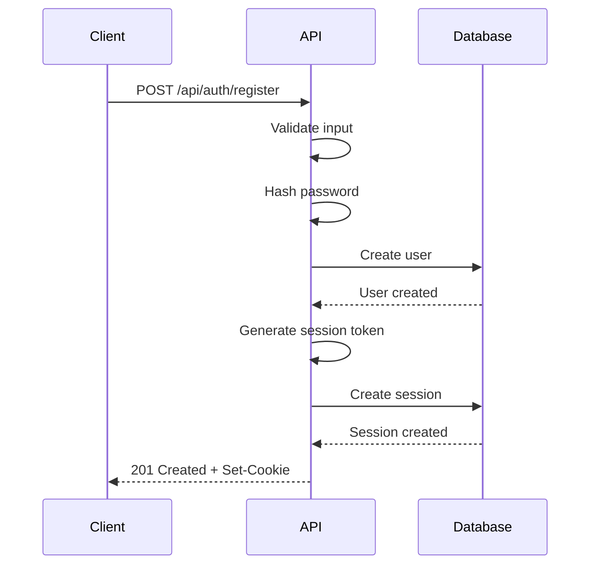
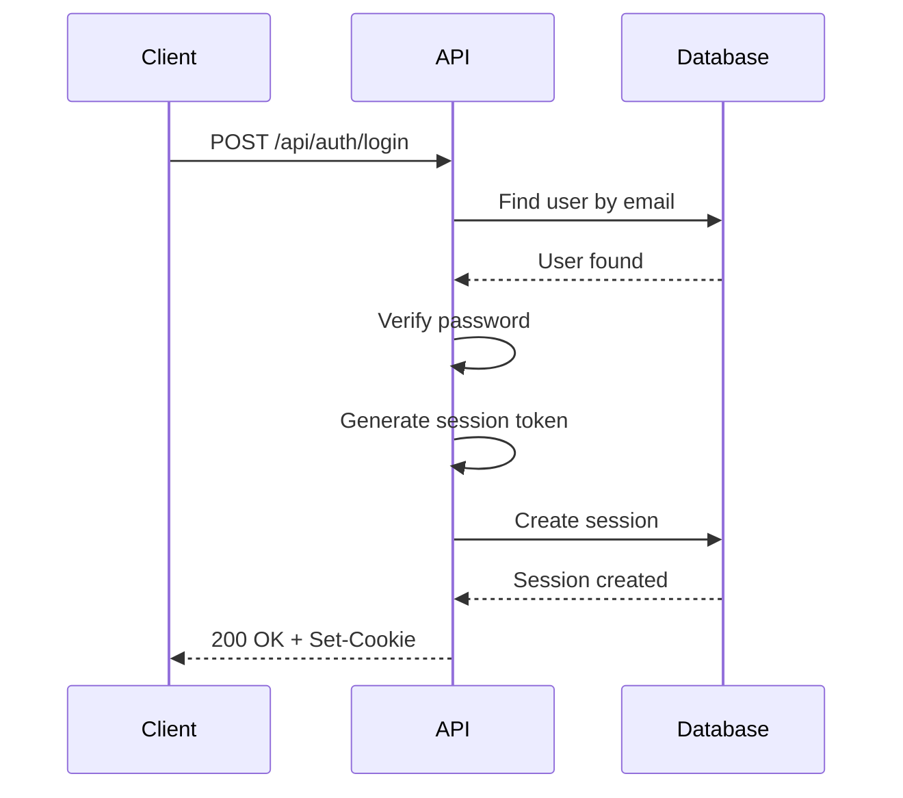
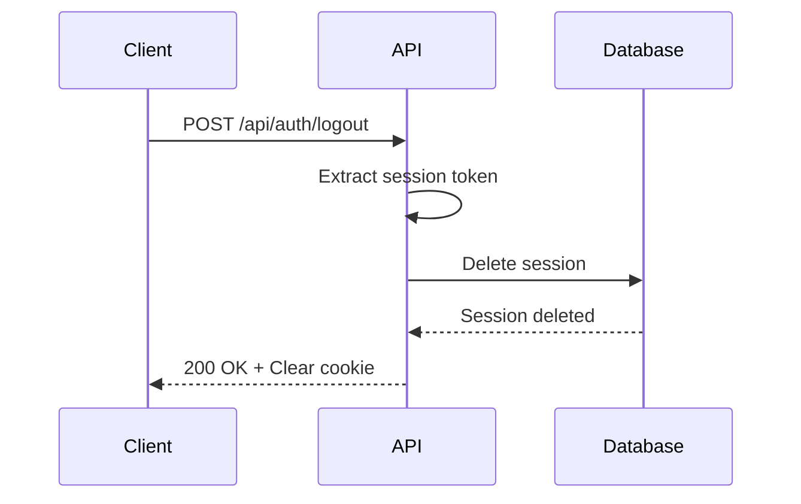

# API Documentation

This document provides comprehensive documentation for all REST API endpoints in the application.

## Table of Contents

- [Authentication](#authentication)
  - [Register User](#register-user)
  - [Login User](#login-user)
  - [Logout User](#logout-user)
- [Error Handling](#error-handling)
- [Rate Limiting](#rate-limiting)
- [Data Models](#data-models)

## Authentication

All authentication endpoints are located under `/api/auth/`.

### Register User

Create a new user account.

**Endpoint:** `POST /api/auth/register`

**Headers:**
```
Content-Type: application/json
```

**Request Body:**
```json
{
  "email": "user@example.com",
  "username": "johndoe",
  "password": "SecurePass123!"
}
```

**Request Fields:**

| Field | Type | Required | Constraints |
|-------|------|----------|-------------|
| email | string | Yes | Valid email format, unique |
| username | string | Yes | 3-20 characters, alphanumeric and underscores only, unique |
| password | string | Yes | Minimum 8 characters, at least one letter and one number |

**Success Response (201 Created):**
```json
{
  "success": true,
  "message": "User registered successfully",
  "user": {
    "id": "clx123456789",
    "email": "user@example.com",
    "username": "johndoe",
    "createdAt": "2024-01-01T00:00:00.000Z"
  }
}
```

**Error Responses:**

400 Bad Request - Invalid input:
```json
{
  "error": "Invalid email format"
}
```

409 Conflict - Email or username already exists:
```json
{
  "error": "Email already registered"
}
```

500 Internal Server Error:
```json
{
  "error": "Failed to create user"
}
```

**Example Request:**
```bash
curl -X POST http://localhost:3000/api/auth/register \
  -H "Content-Type: application/json" \
  -d '{
    "email": "user@example.com",
    "username": "johndoe",
    "password": "SecurePass123!"
  }'
```

---

### Login User

Authenticate an existing user and create a session.

**Endpoint:** `POST /api/auth/login`

**Headers:**
```
Content-Type: application/json
```

**Request Body:**
```json
{
  "email": "user@example.com",
  "password": "SecurePass123!"
}
```

**Request Fields:**

| Field | Type | Required | Description |
|-------|------|----------|-------------|
| email | string | Yes | User's email address |
| password | string | Yes | User's password |

**Success Response (200 OK):**
```json
{
  "success": true,
  "message": "Login successful",
  "user": {
    "id": "clx123456789",
    "email": "user@example.com",
    "username": "johndoe"
  }
}
```

**Response Headers:**
```
Set-Cookie: session-token=<token>; HttpOnly; Secure; SameSite=Strict; Max-Age=604800; Path=/
```

**Error Responses:**

400 Bad Request - Missing fields:
```json
{
  "error": "Email and password are required"
}
```

401 Unauthorized - Invalid credentials:
```json
{
  "error": "Invalid email or password"
}
```

500 Internal Server Error:
```json
{
  "error": "Failed to login"
}
```

**Example Request:**
```bash
curl -X POST http://localhost:3000/api/auth/login \
  -H "Content-Type: application/json" \
  -d '{
    "email": "user@example.com",
    "password": "SecurePass123!"
  }' \
  -c cookies.txt
```

---

### Logout User

End the current user session.

**Endpoint:** `POST /api/auth/logout`

**Headers:**
```
Cookie: session-token=<token>
```

**Success Response (200 OK):**
```json
{
  "success": true,
  "message": "Logged out successfully"
}
```

**Response Headers:**
```
Set-Cookie: session-token=; HttpOnly; Secure; SameSite=Strict; Max-Age=0; Path=/
```

**Error Responses:**

500 Internal Server Error:
```json
{
  "error": "Failed to logout"
}
```

**Example Request:**
```bash
curl -X POST http://localhost:3000/api/auth/logout \
  -H "Cookie: session-token=<your-session-token>" \
  -b cookies.txt
```

---

## Error Handling

All API endpoints follow a consistent error response format:

```json
{
  "error": "Error message describing what went wrong"
}
```

### HTTP Status Codes

| Code | Meaning | Description |
|------|---------|-------------|
| 200 | OK | Request succeeded |
| 201 | Created | Resource created successfully |
| 400 | Bad Request | Invalid request data |
| 401 | Unauthorized | Missing or invalid authentication |
| 403 | Forbidden | Insufficient permissions |
| 404 | Not Found | Resource not found |
| 409 | Conflict | Resource already exists |
| 429 | Too Many Requests | Rate limit exceeded |
| 500 | Internal Server Error | Server-side error |

---

## Rate Limiting

API endpoints may be rate-limited to prevent abuse.

**Rate Limit Headers:**
```
X-RateLimit-Limit: 100
X-RateLimit-Remaining: 99
X-RateLimit-Reset: 1640995200
```

**Rate Limit Exceeded Response (429):**
```json
{
  "error": "Too many requests, please try again later"
}
```

---

## Data Models

### User

```typescript
interface User {
  id: string;           // UUID
  email: string;        // Unique email address
  username: string;     // Unique username
  password: string;     // Hashed password (never exposed in responses)
  createdAt: Date;      // Account creation timestamp
  updatedAt: Date;      // Last update timestamp
}
```

### Session

```typescript
interface Session {
  id: string;           // Session UUID
  userId: string;       // Associated user ID
  token: string;        // Session token (UUID)
  expiresAt: Date;      // Expiration timestamp
  createdAt: Date;      // Session creation timestamp
}
```

---

## Authentication Flow

### Registration Flow



### Login Flow



### Logout Flow



---

## Security Considerations

### Password Storage
- Passwords are hashed using bcryptjs with a cost factor of 10
- Plain-text passwords are never stored or logged

### Session Management
- Session tokens are UUIDs generated using crypto.randomUUID()
- Sessions expire after 7 days by default (configurable)
- Session tokens are stored in HTTP-only, Secure cookies
- Cookies use SameSite=Strict to prevent CSRF attacks

### Input Validation
- All inputs are validated using dedicated validation functions
- Email addresses are validated for format
- Usernames are restricted to alphanumeric characters and underscores
- Passwords require a minimum length and complexity

### Rate Limiting
- API endpoints implement rate limiting to prevent brute-force attacks
- Rate limits are configurable through environment variables

---

## Environment Variables

The following environment variables are required for the API:

```bash
# Database connection
DATABASE_URL="postgresql://..."

# Session secret for signing tokens
SESSION_SECRET="your-random-secret-key"

# Application URL
NEXT_PUBLIC_APP_URL="http://localhost:3000"
```

---

## Testing

### Manual Testing with cURL

```bash
# Register a new user
curl -X POST http://localhost:3000/api/auth/register \
  -H "Content-Type: application/json" \
  -d '{"email":"test@example.com","username":"testuser","password":"Password123"}'

# Login
curl -X POST http://localhost:3000/api/auth/login \
  -H "Content-Type: application/json" \
  -d '{"email":"test@example.com","password":"Password123"}' \
  -c cookies.txt

# Logout
curl -X POST http://localhost:3000/api/auth/logout \
  -b cookies.txt
```

### Automated Testing

The API endpoints have corresponding test files:

- `web/src/__tests__/api/auth/register.test.ts`
- `web/src/__tests__/api/auth/login.test.ts`
- `web/src/__tests__/api/auth/logout.test.ts`

Run tests with:
```bash
cd web
npm test
```

---

## Future Endpoints

The following endpoints are planned for future implementation:

- `GET /api/auth/me` - Get current authenticated user
- `PUT /api/auth/profile` - Update user profile
- `POST /api/auth/forgot-password` - Request password reset
- `POST /api/auth/reset-password` - Reset password with token
- `DELETE /api/auth/account` - Delete user account

---

## OpenAPI Specification

An OpenAPI (Swagger) specification will be available at:
```
GET /api/docs/openapi.json
```

Interactive API documentation will be available at:
```
GET /api/docs
```

---

## Support

For API-related issues or questions:
1. Check the error message for specific guidance
2. Review this documentation
3. Check the server logs for additional details
4. Open an issue on the repository

---

## Version History

| Version | Date | Changes |
|---------|------|---------|
| 1.0.0 | 2024-01-01 | Initial API release with authentication endpoints |
